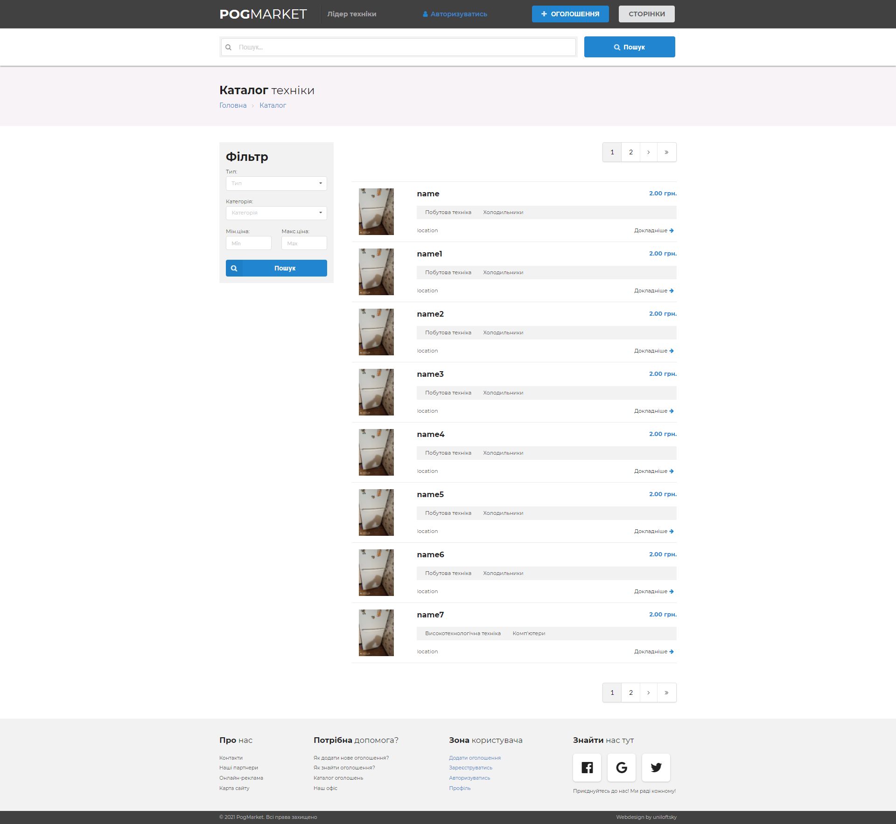
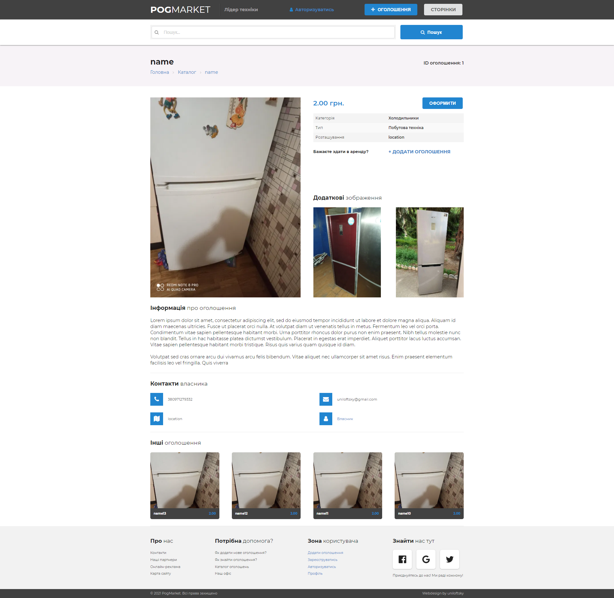
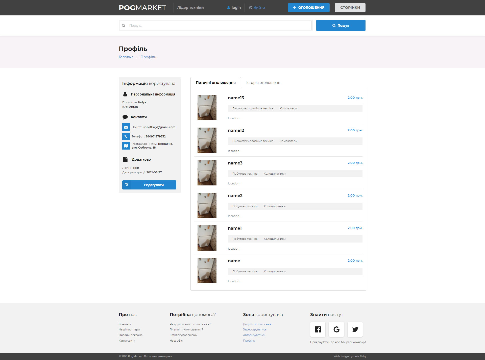

# spring5-appliances-rent
Spring5 applicanes renting web application

## Getting Started

Appliances Rent App is a Spring Boot application built using Maven. You can build a jar file and run it from the command line (JDK 11 is required):

```bash
git clone https://github.com/uniloftsky/spring5-appliances-rent
cd spring5-appliances-rent
./mvnw package
java -jar target/*.jar
```

You can then access app here: [http://localhost:8080](http://localhost:8080)
<br>

## Pages view
Index page:<br>

<hr>

Post page:<br>

<hr>

Post add page:<br>

<hr>

Profile page:<br>
